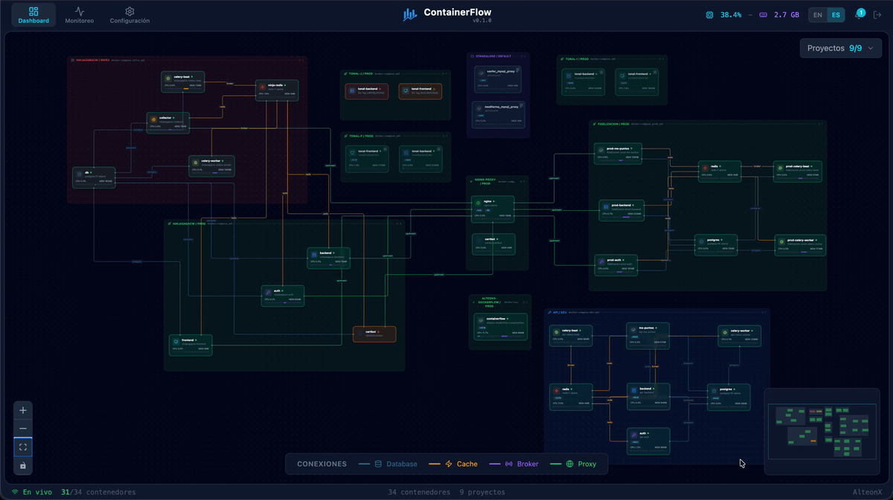

# ContainerFlow

[](https://github.com/RGJorge/containerflow/actions/workflows/ci.yml)
[](https://www.gnu.org/licenses/agpl-3.0)

Real-time Docker architecture visualizer. Displays services, connections and metrics from all your Docker Compose projects in an interactive dashboard.



## Requisitos

- [Bun](https://bun.sh) >= 1.0
- Docker corriendo con acceso al socket (`/var/run/docker.sock`)

## Instalacion

```bash
git clone https://github.com/RGJorge/containerflow.git
cd containerflow
bun install
```

## Configuracion

Copiar el archivo de ejemplo y editar:

```bash
cp .env.example .env
```

Variables disponibles:

| Variable | Default | Descripcion |
|---|---|---|
| `PORT` | `9470` | Puerto del servidor |
| `AUTH_TOKEN` | _(vacio)_ | Token de autenticacion. Vacio = sin auth, solo localhost. Con valor = auth activado, acceso remoto |

## Uso

### Desarrollo (hot reload)

```bash
bun run dev
```

Abre `http://localhost:9420` (Vite dev con hot reload, proxea API al backend en puerto 9470).

### Produccion

```bash
bun run build
bun run start
```

Abre `http://localhost:9470`.

### Modos de visualizacion

```bash
# Ver TODOS los containers Docker
bun run start -- --all

# Ver solo proyectos especificos
bun run start -- --projects=mi-proyecto,otro-proyecto

# Auto-detectar desde el directorio actual
bun run start
```

## Funcionalidades

- **Descubrimiento automatico** — detecta servicios via Docker socket, agrupa por proyecto o compose file
- **Conexiones inteligentes** — detecta relaciones app→database, app→cache, proxy→app, worker→broker
- **Metricas en tiempo real** — CPU y memoria por container, actualizado cada 3 segundos
- **Eventos Docker** — flash visual cuando un container inicia, para o reinicia
- **Panel de detalle** — click en un container para ver info, stats, variables de entorno y configuracion en tabs separados
- **Logs de containers** — logs en tiempo real con scroll automatico, filtro por stream (stdout/stderr) y opcion de copiar
- **Acciones sobre containers** — start, stop, restart, rebuild y remove directamente desde el panel
- **Filtro de proyectos** — dropdown para mostrar/ocultar proyectos, persiste entre sesiones
- **Autenticacion** — pantalla de login con AUTH_TOKEN para acceso remoto seguro
- **Leyenda de conexiones** — colores por tipo: Database (azul), Cache (rojo), Broker (naranja), Proxy (verde)
- **Grupos visuales** — recuadros por proyecto/compose con titulo, archivo compose y conteo de containers
- **Menu contextual** — click derecho en un nodo para acciones rapidas
- **Pagina de monitoring** — vista de eventos Docker recientes
- **Pagina de settings** — configuracion de la aplicacion

## Tests

El proyecto usa [Vitest](https://vitest.dev/) para tests unitarios.

```bash
# Correr todos los tests
bun run test

# Correr en modo watch (re-ejecuta al guardar)
bun run test:watch

# Verificar tipos TypeScript
bun run typecheck
```

Los tests cubren:

- **Logica de processing** (`src/client/hooks/processing.test.ts`) — sincronizacion de estados cuando se ejecutan acciones sobre containers (start/stop/restart), incluyendo manejo de estados crashed/dead, timeouts y minDuration
- **Deteccion de conexiones** (`src/server/docker.test.ts`) — descubrimiento de relaciones entre servicios por red compartida, clasificacion de servicios (infra, proxy, worker) y deduplicacion

## CI

GitHub Actions ejecuta automaticamente en cada push/PR a `main`:

1. Typecheck (errores de tipos)
2. Tests (Vitest)
3. Build (produccion)

Ver `.github/workflows/ci.yml`.

## Stack

| Componente | Tecnologia |
|---|---|
| Runtime | Bun |
| Server | Hono |
| Frontend | React 19 + Vite 6 |
| Grafos | @xyflow/react 12 |
| Estilos | Tailwind CSS 4 |
| Iconos | Lucide React |
| Docker API | dockerode |
| Comunicacion | WebSocket nativo |
| Tests | Vitest |

## Estructura

```
src/
  server/
    index.ts        — servidor Hono + WebSocket + CLI args
    docker.ts       — descubrimiento de servicios y conexiones
    watcher.ts      — polling de stats + stream de eventos Docker
  client/
    App.tsx          — dashboard principal + login screen
    main.tsx         — entry point React
    index.css        — Tailwind + animaciones custom
    nodes/
      ServiceNode.tsx — nodo visual por container
      GroupNode.tsx    — header de grupo (proyecto/compose)
    hooks/
      useDocker.ts   — hook WebSocket para datos en tiempo real
      processing.ts  — logica pura de estados processing
    engine/
      layout.ts      — layout de grupos + grid + edges
    components/
      HeaderBar.tsx      — barra superior con navegacion
      EdgeLegend.tsx     — leyenda de tipos de conexion
      LoginScreen.tsx    — pantalla de autenticacion
      NodeContextMenu.tsx — menu contextual de nodos
      OffsetEdge.tsx     — edge custom con offset para evitar superposicion
    panels/
      DetailPanel.tsx — panel lateral con info, stats, env, config y logs
      LogPanel.tsx    — panel de logs por container
    pages/
      MonitoringPage.tsx — vista de eventos Docker
      SettingsPage.tsx   — configuracion de la aplicacion
  shared/
    types.ts         — tipos compartidos server/client
```

## Licencia

Copyright (C) 2026 Jorge Gonzalez D. (RGJorge)

Este proyecto esta licenciado bajo **GNU Affero General Public License v3.0** (AGPL-3.0). Ver el archivo [LICENSE](LICENSE) para los terminos completos.

Para uso comercial con codigo cerrado, contactar para una licencia comercial: alteonx.servicios@gmail.com
